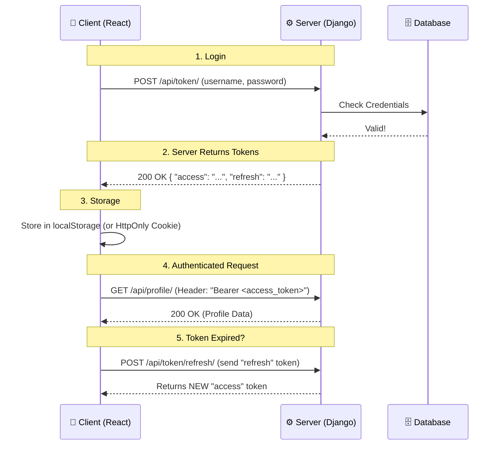
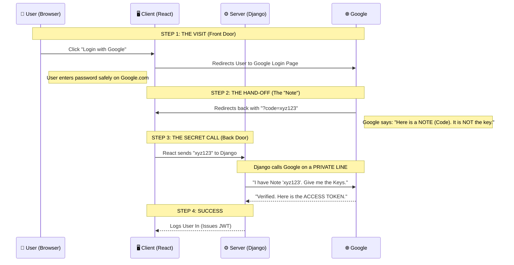

# Practice Question


## Question 1 (Very Common): How do you handle authentication in your APIs?"
**The Concept:** When an interviewer asks this, they are asking: "Is your API **stateful** (remembers the user) or **stateless** (doesn't remember)?"

For modern REST APIs (especially with React/mobile frontends), the industry standard is **Stateless Authentication using JWT (JSON Web Tokens)**. This matches the "Key talking points" in your notes.

**How to Construct Your Answer:** Don't just list steps. Tell a story about the data flow.

- **The Hook:** Start by mentioning the specific technology (Django REST Framework & SimpleJWT).
    
- **The Flow:** distinct steps where the client and server exchange information.

### Step 1️⃣ — Open high-level (very important)

Most strong candidates start like this:

> **“I usually handle authentication in my APIs using token-based authentication, most commonly JWT.”**

### Step 2️⃣ — Explain the flow (simple)

Next sentence:

> **“The user logs in with their credentials (send their credentials to my api/token), and the server verifies them and returns an access token & an refresh token”**

##### ### Concretely, on the backend (Django mindset 🐍), what does it means by 'if valid':

###### 1️⃣ User sends credentials

Usually:

- username / email
    
- password (plain text over **HTTPS**)
    

---

###### 2️⃣ Server checks the user exists

Django does something like:

- Look up the user in the database
    
- Example: `User.objects.get(email=...)`
    

❌ If no user → invalid

---

###### 3️⃣ Server verifies the password

This is the **most important part** 🔐

- Passwords are **never stored in plain text**
    
- Django stores **hashed passwords**
    
- It:
    
    - hashes the incoming password
        
    - compares it with the stored hash
        

👉 If hashes match → ✅ valid  
👉 If not → ❌ invalid

---

###### 4️⃣ Only THEN tokens are created

If **both** are true:

- user exists
    
- password matches
    

➡️ Server generates:

- access token
    
- refresh token
    

---

###### 🧩 One-sentence interview explanation

If they ask _“what do you mean by valid?”_, say:

> **“It means the server verifies that the user exists and that the provided password matches the stored hashed password.”**

That sentence alone = 💎


--- 
> **Storage:** The client stores these tokens (usually in `localStorage` or `httpOnly` cookies). The client includes this access token in the Authorization header (Bearer) for every protected request.". 
> **Refresh:** When the access token expires, the client uses the `refresh` token to request a new access token without forcing the user to log in again.
### Step 4️⃣ — Why this approach

Finish with _why_:

> **“This keeps the API stateless, scalable, and works well for frontend apps like React or mobile clients.”**

🔥 Interviewers love this line.


## Question 2: "Explain JWT vs. Session-based Auth"

- **Session-based (The Old Way/Traditional Django):** The server keeps a record (a session ID) in its database. The user carries a "key" (cookie) to that record.
	- **Session** = Server remembers (Stateful).
    
- **JWT (The API Way):** The server signs a "badge" (the token) and gives it to the user. The server stores _nothing_. The user carries the whole badge.
	- **Token** contains the data (Stateless).
 
| **Feature**     | **🍪 Session-Based**                            | **🔑 JWT (Token-Based)**                           |
| --------------- | ----------------------------------------------- | -------------------------------------------------- |
| **State**       | **Stateful:** Server remembers the session.     | **Stateless:** Server just verifies the signature. |
| **Storage**     | Server Database + Client Cookie.                | Client Storage (LocalStorage/Cookie).              |
| **Scalability** | Harder (Need to share sessions across servers). | Easier (No server storage needed).                 |
| **Best For**    | Traditional server-rendered websites.           | **APIs, Mobile Apps, SPAs (React).**               |
**🗣️ Your Answer:** "The main difference is where the user's state is stored:

- **Session-based auth is stateful.** The server creates a session ID and **stores it in the database**. The client just holds the ID. This requires the server to check the database on every request.
    
- **JWT is stateless.** The server generates a signed token that **contains the user's data**. The server does _not_ need to store this token in the database; it simply validates the signature.
    

I choose JWT for my APIs because it scales better (no database lookups for auth) and is easier to use across different platforms like mobile apps and React.


## Question 3: How do you secure your Django applications?
Django security = **layers** 🛡️  
Think:

> **Auth → Data → Requests → Transport**

You don’t say that out loud — but it guides your answer.

### 🧩 Step 1 — Strong opening sentence

Almost every good answer starts like this:

> **“I secure my Django applications by combining Django’s built-in security features with proper configuration and API-level protections.”**

This sounds mature and calm 😌

**🗣️ Your Answer:** "I secure my applications by leveraging Django's built-in defenses and following production best practices. Specifically, I focus on five key areas:

1. **SQL Injection:** I rely on the **Django ORM**, which uses parameterized queries by default. This ensures that user input is never executed as code in the database.
    
2. **XSS (Cross-Site Scripting):** I use Django's templating engine, which **auto-escapes HTML** characters, preventing malicious scripts from running in the browser.
    
3. **CSRF (Cross-Site Request Forgery):** For session-based views, I strictly use the `@csrf_protect` decorator. However, since my API uses JWTs, CSRF is generally less of a concern for those specific endpoints, but I keep it enabled for the admin panel.
    
4. **HTTPS:** In production, I always enforce SSL by setting `SECURE_SSL_REDIRECT = True` to encrypt all traffic.
    
5. **Rate Limiting:** To prevent abuse or DDoS attempts, I implement rate limiting using libraries like `django-ratelimit` or at the API gateway level."
    
### Quick Summary of the "Why" (In case they drill down)

##### SQL Injection
	Attackers trying to steal data by typing SQL commands into input fields. _Django ORM blocks this._
	## 🧠 First: what the code is TRYING to do

The developer wants to check:

> “Does a user exist with **this username AND this password**?”

So the SQL is:

`SELECT * FROM users WHERE username = 'input' AND password = 'input';`

Meaning in English:

> “Give me users whose username is X **and** password is Y.”

---

###### 🚨 The mistake (this is the key)

The mistake is:  
👉 **user input is directly glued into the SQL string**

The database cannot tell:

- what is **data**
    
- what is **SQL logic**
    

---

###### 🎭 Now the attacker enters something sneaky

Instead of a normal username, attacker types:

`' OR 1=1 --`

Let’s replace `input` with that value.

---

###### 🧩 Step-by-step substitution

####### Username part becomes:

`username = '' OR 1=1 --`

So the full query becomes:

`SELECT * FROM users WHERE username = '' OR 1=1 --' AND password = 'anything';`

---

###### 🧠 Now read this like the database does

####### 1️⃣ `username = ''`

Probably false (empty username)

###### 2️⃣ `OR 1=1`

⚠️ **This is always TRUE**

So now the condition is:

`(FALSE OR TRUE)`

Which equals **TRUE**

---

###### 3️⃣ What does `--` mean?

`--` is a **comment** in SQL.

Everything after it is ignored.

So this part is ignored:

`AND password = 'anything';`

💥 Password check is gone.

---

###### 🎯 Final meaning to the database

The database hears:

> “Give me ANY user where the condition is TRUE.”

➡️ It returns the first user  
➡️ App thinks: “Login success”  
➡️ Attacker is in 😱

---

###### 🧠 One-sentence summary (lock this in)

> **SQL injection works because user input is treated as SQL code instead of data.**
###### 😱 Why this is dangerous

Attackers can:

- Bypass login
    
- Read all data
    
- Delete tables
    
- Modify records
    

This is **game over** level 🚨

---

####### 🛡️ Why Django ORM saves you

Django uses **parameterized queries**:

When you do:

`User.objects.get(username=username)`

Django sends:

`WHERE username = %s`

The input is treated as **data**, not executable SQL.

So `' OR 1=1 --` becomes:

- just a string
    
- not executable SQL

👉 Injection becomes impossible.

##### 🧠 The core idea XSS

**XSS = Attackers trying to run JavaScript on other users' screens. _Django Templates block this._

Not your server.  
**The victim is your user.**

---

###### 🎭 Simple story

Imagine your app lets users post comments:

`Hello everyone!`

Now an attacker posts:

`<script>alert('Hacked')</script>`

If your app **renders this directly** →  
💥 the browser executes the script.

---

###### 😱 Why this is dangerous

That injected JS can:

- Steal JWT tokens from `localStorage`
    
- Steal cookies
    
- Redirect users
    
- Act **as the user**
    

👉 This is how accounts get hijacked.

---

###### 🛡️ Why Django is strong here

Django templates **auto-escape HTML**:

`<script>alert(1)</script>`

Becomes:

`&lt;script&gt;alert(1)&lt;/script&gt;`

Browser sees **text**, not code ✅

---

###### 🎤 Interview one-liner

> **“XSS is when malicious JavaScript is injected into a page and executed in the user’s browser. Django prevents it by auto-escaping output in templates.”**
    
- **CSRF:** Attackers tricking a user's browser into making unwanted requests. _Django Tokens block this._


## Question 4: "Walk me through your CORS setup"
**The Concept:** Browsers are paranoid by default. They block your frontend (e.g., React on port 3000) from talking to your backend (e.g., Django on port 8000) because they are on different "origins" (different ports or domains).

**CORS (Cross-Origin Resource Sharing)** is the way your backend tells the browser: _"It's okay, I know this guy. Let him in."_

**The Strategy:** Your answer needs to show you are precise. You don't just allow _everyone_ (which is dangerous); you whitelist specific domains.

**🗣️ Your Answer:** "I handle CORS using the `django-cors-headers` library. My setup focuses on two key configurations to ensure my React frontend can securely talk to the Django backend:

1. **Whitelisting Origins:** I explicitly define `CORS_ALLOWED_ORIGINS`.
    
    - I add `http://localhost:3000` for my local React development server.
        
    - I add my production domain, `https://myapp.com`, so the live site works.
        
    - This prevents random, unauthorized websites from using my API.
        
2. **Allowing Credentials:** I set `CORS_ALLOW_CREDENTIALS = True`.
    
    - This is crucial because it allows the frontend to send HTTP cookies and authentication headers (like the JWT Bearer token) with the request. Without this, the browser would block the login attempts."
        

---

### What is the different between CORS and CSRF ? 

#### 🌐 Story 1 — **CORS**

##### “Who is allowed to talk to me?”

##### Characters:

- 🧑 You (the user)
    
- 🌍 Browser (Chrome)
    
- 🎨 Frontend (React app)
    
- 🧠 Backend API (Django)


You can explain the **Same-Origin Policy**:

- **The Rule:** By default, a browser script (like your React app) is only allowed to talk to the _exact same server_ it came from.

##### 🛡️ The Core Concept: The Same-Origin Policy (SOP)

Before we talk about CORS (the solution), we must understand the problem: **The Same-Origin Policy (SOP).**

This is a fundamental security rule built into every modern web browser (Chrome, Firefox, Safari).1

**The Rule:** By default, a script running on **Site A** is **forbidden** from reading data from **Site B**.2

##### 1. What defines an "Origin"?

Two URLs have the same origin _only_ if they have the exact same:

1. **Protocol** (e.g., `https`)
    
2. **Domain** (e.g., `google.com`)
    
3. **Port** (e.g., `:443` or `:3000`)3
    

$$Origin = Protocol + Domain + Port$$

If **even one** of these differs, the browser considers them strangers and blocks the interaction.

|**URL 1**|**URL 2**|**Outcome**|**Reason**|
|---|---|---|---|
|`https://myapp.com`|`https://myapp.com/api`|✅ **Allowed**|Same Origin|
|`http://myapp.com`|`https://myapp.com`|❌ **Blocked**|Different Protocol (http vs https)|
|`https://myapp.com`|`https://api.myapp.com`|❌ **Blocked**|Different Subdomain|
|`http://localhost:3000`|`http://localhost:8000`|❌ **Blocked**|Different Port (The React vs Django issue!)|

---

##### 🔓 Enter CORS: The "VIP Guest List"

So, SOP is great for security. But it breaks modern web apps because **React (localhost:3000)** and **Django (localhost:8000)** are technically "strangers" (different ports).

**CORS (Cross-Origin Resource Sharing)** is the standard way for the _Server_ to tell the _Browser_: "Relax, I know this guy."

**The Flow (The "Preflight" Check):**

1. **The Knock:** When React tries to send a request (like a POST with a JWT) to Django, the browser pauses. It doesn't send the real data yet.
    
2. **The Question (Preflight):** The browser sends a tiny test request (method: `OPTIONS`) to Django essentially asking: _"Hey, `localhost:3000` is trying to talk to you. Is that okay?"_
    
3. **The Answer:** Your Django server (via `django-cors-headers`) looks at its whitelist (`CORS_ALLOWED_ORIGINS`).4
    
    - If `localhost:3000` is on the list, it replies: _"Yes, allow `localhost:3000` and allow these headers."_
        
4. **The Action:** The browser receives this permission, smiles, and finally sends the _real_ POST request.


###### 1. CORS: The "Tinted Window" (Privacy)

**The Problem:** Can a stranger **look** at your money?

- **The Scenario:** You drive your Car (Browser) to the Bank Teller.
    
- **The Rule (Same-Origin Policy):** To protect your privacy, the Car has **blacked-out windows**.
    
- **The Situation:** You try to ask the Teller: "How much money do I have?" (A `GET` Request).
    
- **The Block:** The Teller shouts the answer back, "You have $1,000!"... **BUT**, because the windows are blacked out, **you cannot see or hear the answer.** The Car protects you from seeing data unless the Bank explicitly says it's okay.
    
- **The Fix (CORS):** The Bank Teller gives your specific Car a special pass that rolls down the window.
    
    - _Without CORS:_ The request happens, but you **can't see the result**.
        
    - _With CORS:_ The window rolls down, and you can read the data.
        

> **CORS** prevents unauthorized sites from **READING** your data.
##### 🔑 Key truth about CORS

- CORS is **NOT about security against hackers**
    
- It is about **browser rules**
    
- It controls **which frontend websites** can call your API
- **CORS = frontend → backend permission**

---

#### 🌐 Story 2 — **CSRF##### “Is this really the user, or am I being tricked?”

##### Characters:

- 🧑 You (already logged in)
    
- 🍪 Browser cookies
    
- 🏦 Backend (bank.com)
    
- 😈 Malicious site (evil.com)
    

---
##### What’s happening?
###### 1. The Core Rule: "Cookies are Automatic"

This is the single most important thing to understand: **If your browser has a cookie for `bank.com`, it will attach that cookie to ANY request going to `bank.com`, no matter where that request started.**

It doesn't matter if the request started from `bank.com` (good) or `evil-hacker.com` (bad). If the destination is the Bank, the browser slaps the cookie on it.

###### 2. The Attack (Step-by-Step)

Let’s replay the attack without the "Note" metaphor.

1. **The Setup:** You log in to your bank. Your browser saves a **Session Cookie**.
    
    - _Browser thinks:_ "Okay, whenever I talk to the Bank, I must show this Cookie so they know it's me."
        
2. **The Trap:** You visit `evil-hacker.com`.
    
    - Inside the code of this website, there is a hidden invisible form.
        
    - The form says: `<form action="https://bank.com/transfer" method="POST">`
        
    - JavaScript on the page automatically submits this form.
        
3. **The Betrayal (This is the "Note in Pocket" part):**
    
    - The browser sees a request going to `bank.com`.
        
    - The browser follows its one rule: **"Oh! A request for the Bank? I have a cookie for that! I'll attach it."**
        
    - The browser sends the malicious request **WITH your valid Session Cookie**.
        
4. **The Server's Mistake:**
    
    - The Bank receives the request: "Transfer $1,000."
        
    - It checks the Cookie: "The Cookie is valid. This must be the real user."
        
    - **It processes the transfer.**
        

###### 3. Why the Analogy Failed

In the analogy:

- **"You don't know the note is there"** = The attack happens in the background (invisible form).
    
- **"You hand the Teller your ID"** = The browser automatically attaches the Session Cookie.
    
- **"The Teller thinks YOU wrote it"** = The server sees the valid cookie and assumes you intended to make the transfer.
    

###### 4. How to Fix It (The CSRF Token)

Since the browser automatically sends Cookies (which we can't stop), we need a **second check** that the browser _doesn't_ do automatically.

- **The Fix:** We force every form to include a random secret code (Token) that is **NOT** a cookie.
    
- **The Result:**
    
    - `evil-hacker.com` can trigger the request.
        
    - The Browser adds the Cookie (ID).
        
    - **BUT**, the Hacker doesn't know the secret Token.
        
    - The Bank checks: "Valid Cookie? Yes. Valid Token? **NO.** Blocked!"
---

##### 🔑 Key truth about CSRF

- Cookies are sent **automatically**
    
- Backend cannot tell **who initiated the request**
    
- CSRF tokens prove **user intent**
    

👉 **CSRF = protecting logged-in users**

##### 🎤 Summary for the Interview

If they ask, _"Why do we need CORS?"_, you can now answer with authority:

> "We need CORS because browsers enforce the **Same-Origin Policy** to prevent malicious sites from stealing user data or executing unauthorized actions on other sites.5
> 
> However, since my frontend (React) and backend (Django) run on different ports, the browser considers them different origins and blocks the connection by default.
> 
> **CORS** allows me to safely relax this rule. It lets my backend explicitly 'whitelist' my frontend domain so they can communicate, while still blocking everyone else."


|**Setting**|**Your Code**|**Why?**|
|---|---|---|
|**Who is allowed?**|`CORS_ALLOWED_ORIGINS`|To strict whitelist only _your_ frontend (React), keeping hackers out.|
|**Can we send Auth?**|`CORS_ALLOW_CREDENTIALS = True`|To let the browser send tokens/cookies across different ports.|

### 🚨 One important rule (senior signal)

If you say this, you score points:

> **“I avoid using `CORS_ALLOW_ALL_ORIGINS` in production for security reasons.”**

🔥 That’s a green flag sentence.


# Key talking points

## 🔐 1. JWT Token Flow (What + Why)
### 🎯 What problem it solves

👉 Stateless authentication for APIs  
👉 Perfect for React / mobile / SPA apps

This is the heartbeat of your API. The interviewer wants to know you understand the _cycle_ of authentication, not just the login.

**The Concept:** It is a "Stateless" system. The server doesn't remember you; it gives you an ID card (Token) that proves who you are.


👉 Better UX, no forced re-login.

**Talking Points Breakdown:**

1. **Login:** User sends credentials.
    
2. **Issue:** Server signs two tokens:
    
    - `access`: Short-lived (e.g., 5-15 mins). Used for API calls.
        
    - `refresh`: Long-lived (e.g., 24 hours). Used _only_ to get new access tokens.
        
3. **Store:** Client saves them. (Pro-tip: `HttpOnly` cookies are safer than `localStorage` to prevent XSS).
    
4. **Send:** Every request must have `Authorization: Bearer <token>`.
    
5. **Renew:** When the `access` token dies (401 error), the client quietly asks for a new one using the `refresh` token.

### 🎤 Interview one-liner

> **“JWT allows stateless authentication by issuing short-lived access tokens and refresh tokens, which the client uses to authenticate API requests.”**


## 🔑 2. OAuth 2.0 (Third-Party Login)

### 🎯 What problem it solves

👉 “Login with Google / GitHub”  
👉 You **don’t** handle passwords




### _The “Secret Call” (Clean Version)_

### The Core Idea (1 sentence)

We want users to log in with Google **without ever exposing the Access Token in the browser**, so we use a temporary **Authorization Code** and exchange it **server-to-server**.

---

### The Flow (Simple, Human, Precise)

#### **Step 1 — The Visit (Front Door)**

- The user clicks **“Login with Google”**.
    
- Your app redirects the user to **Google’s login page**.
    
- The user enters their credentials **on Google**, not your app.
    

> Google says:  
> _“I trust this user. But I won’t give tokens to the browser.”_


#### Browser is not safe 
##### Short answer (interview-ready)

> **Because anything in the browser can be read, logged, copied, or leaked.**

Now the _real_ reasons 👇

---

##### 🚨 Real risks in the browser

##### **A. URLs are visible and logged**

If a token appears in a URL:

- Browser history
    
- Server logs
    
- Analytics tools
    
- Referrer headers
    
- Screenshots
    

👉 **You can’t control where it goes.**

---

##### **B. JavaScript is not trustworthy**

Anything accessible to JS can be stolen via:

- XSS attacks
    
- Malicious dependencies
    
- Browser extensions
    

If an Access Token lives in JS:

> Assume it will eventually leak.

---

##### **C. Browsers talk too much**

Browsers automatically:

- attach headers
    
- follow redirects
    
- send referrers
    

Tokens don’t belong in a place that **auto-shares context**.

---

##### **D. The browser cannot keep secrets**

This is the key OAuth assumption:

> **A browser is a public environment.  
> A server is a private environment.**

Browsers **cannot safely store secrets**.  
Servers can.

---

##### 🔐 What OAuth designers decided

- Browsers get **temporary, useless things** (Auth Code)
    
- Servers get **powerful things** (Access Token)
    

#### **Step 2 — The Hand-off (The Note)**

- Google redirects the user back to your app with a **temporary Authorization Code**.
    
- This code is **short-lived** and **not a token**.
    

> Google says:  
> _“Take this Note back to your backend.”_

---
#### **Step 3 — The Secret Call (Back Door)**

- Your React app sends the **Authorization Code** to your Django backend.
    
- Your backend makes a **server-to-server request** to Google.
    
- It exchanges the code **plus a Client Secret** for an **Access Token**.
    

> Google says:  
> _“You’re calling from a trusted server. Here’s the token.”_

---
##### What's Client Secret ?
You’re right about _one thing_:

> ❌ The backend does **not** call Google with _only_ the Authorization Code.

It calls Google with **two things**.

---

###### 🔑 The OAuth Exchange requires:

When Django calls Google, it sends:

1. **Authorization Code** (from the browser)
    
2. **Client ID** (public)
    
3. **Client Secret** (private)
    
4. Redirect URI (must match exactly)
    

Example (simplified):

```
POST https://oauth2.googleapis.com/token

{
  "code": "xyz123",
  "client_id": "abc.apps.googleusercontent.com",
  "client_secret": "SUPER_SECRET_VALUE",
  "redirect_uri": "https://yourapp.com/oauth/callback",
  "grant_type": "authorization_code"
}

```

---

##### 🧠 What the Client Secret actually is

> **The Client Secret proves to Google:  
> “This request is coming from the real backend, not a browser or attacker.”**

###### Start with this truth (foundational)

> **OAuth is not just about users.  
> It’s also about verifying the application itself.**

Google is asking **two questions**, not one:

1️⃣ _Is this user really who they say they are?_  
2️⃣ _Is this app really the app that registered with me?_

The **Client Secret answers question #2**.


It is:

- Issued by Google when you register your app
    
- Stored **only on the backend**
    
- Never exposed to users
-
- When you go to Google Cloud Console and create OAuth credentials, Google gives you:

- **Client ID** → public identity of your app
    
- **Client Secret** → private proof of your app
    

Think of it like this:

|Thing|Meaning|
|---|---|
|Client ID|“Hi, I am App X”|
|Client Secret|“Here is proof that I am REALLY App X”|

Anyone can say the first.  
Only **your backend** can say the second.


###### 🧠 What Google is protecting against

Imagine this scenario without a Client Secret:

- Attacker creates a fake app
    
- Steals an Authorization Code from a user’s browser
    
- Calls Google and says:
    
    > “Hey, I’m your app. Give me the token.”
    

Without a Client Secret, **Google has no way to tell** if that call is:

- your real backend
    
- or a random attacker
    

So Google says:

> “Show me the secret I gave only to the real app.”

---

###### 🔐 Why the Client Secret must stay on the backend

####### Because it is **shared trust**

- Google trusts **your backend**
    
- Your backend proves itself using the Client Secret
    

If the Client Secret leaks:

- Anyone can impersonate your app
    
- Anyone can exchange stolen codes for tokens
    
- Google can no longer trust requests claiming to be “you”
    

That’s why:

- ❌ Never in frontend code
    
- ❌ Never in JavaScript
    
- ❌ Never in mobile apps
    
- ✅ Only in backend environment variables
#### **Step 4 — Login Complete**

- Your backend:
    
    - creates or finds the user
        
    - issues **your own JWT/session**
        
- The frontend is now logged in.
    

---

#### Why This Is Secure (This Is the Money Part 💰)

#### The browser is not a safe place

- URLs are visible
    
- JavaScript can be compromised
    
- Extensions, XSS, logs exist
    

So:

- **The browser only ever sees a temporary Code**
    
- **The real Token never touches the URL or frontend**
    

Even if an attacker steals the Code:

- It’s useless without the **Client Secret**
    
- Only your backend can exchange it
    

---

#### The Interview Answer (Say This)

> **“I use the OAuth 2.0 Authorization Code flow because the browser isn’t secure.  
> Google gives the browser a temporary authorization code, not the access token.  
> My backend then exchanges that code for the real token using a secure server-to-server call with a client secret.  
> This ensures the access token is never exposed in the browser or URL.”**

Stop there. Don’t overtalk.

## 🔑 3. CORS Configuration (The Rules)
You already mastered the "Why" (Reading vs. Writing). Now let's look at the **"How"** (The Code).

**The Code Snippet Explained:**

Python

```
# 1. The Whitelist (Who can knock?)
CORS_ALLOWED_ORIGINS = [
    "http://localhost:3000",  # Your local React app
    "https://myapp.com",      # Your real website
]

# 2. The ID Card Rule (Can they bring cookies?)
CORS_ALLOW_CREDENTIALS = True 
```

**Talking Points Breakdown:**

- **`CORS_ALLOWED_ORIGINS`:** This is the most critical setting. It tells Django exactly which domains are allowed to make cross-origin requests.
    
    - _Interview Note:_ "I never use `CORS_ORIGIN_ALLOW_ALL = True` in production because it is insecure. I explicitly whitelist my frontend domains."
        
- **`CORS_ALLOW_CREDENTIALS = True`:** This is required if your frontend needs to send **cookies** or **HTTP Authentication headers** (like your JWT Bearer token) in the cross-origin request.

